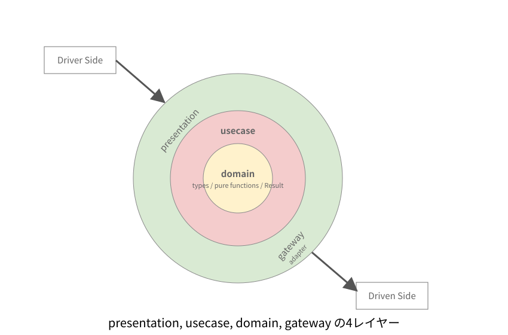

# architecture

このプロジェクトで使用するアーキテクチャについて定義

## アーキテクチャについて

- [小規模から成長させるアプリケーションアーキテクチャ](https://note.com/suwash/n/n869c06c749e6) をもとにして、
- クリーンアーキテクチャを崩したshアーキテクチャを採用する。
- shアーキテクチャはIFを利用しない. 詳細は以下を参照
  - [`docs/contributing/assets/app-architecture.mmd`](assets/app-architecture.mmd)
  - [`docs/contributing/assets/app-architecture-layers.svg`](assets/app-architecture-layers.svg)

### アーキテクチャ図

- 図の正本は Mermaid source の [`docs/contributing/assets/app-architecture.mmd`](assets/app-architecture.mmd) とする。
- 生成物は [`docs/contributing/assets/app-architecture.svg`](assets/app-architecture.svg) とする。
- SVG は `pnpm run docs:app-architecture:svg` で再生成する。
- 4レイヤー概念図は [`docs/contributing/assets/app-architecture-layers.svg`](assets/app-architecture-layers.svg) を正本とする。

