---
codd:
  node_id: design:development-flow
  type: design
  status: draft
  depends_on:
    - id: req:siftq-system
      relation: depends_on
      semantic: governance
    - id: design:sympohy-issue-execution
      relation: depends_on
      semantic: automation
---

# 開発フロー

図の正本は [`docs/contributing/assets/development-flow.mmd`](assets/development-flow.mmd) とする。

## 全体図

