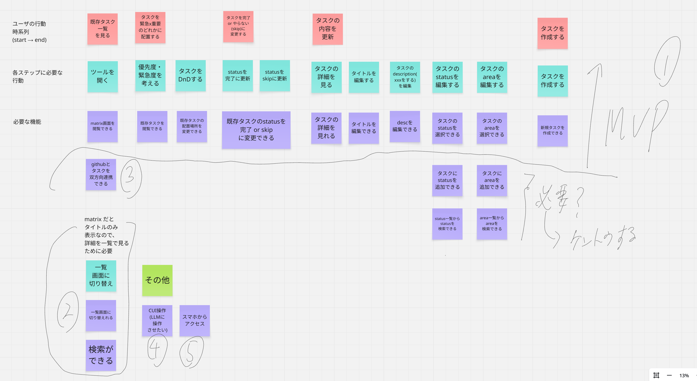
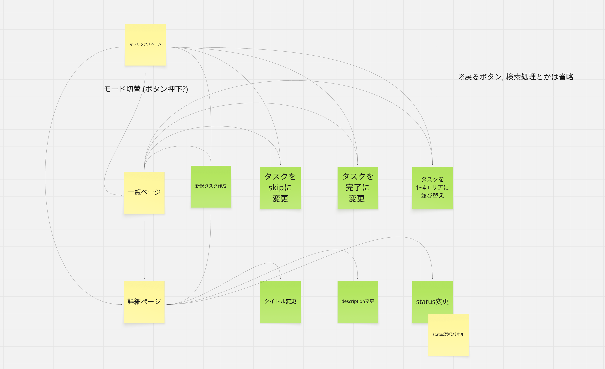

---
codd:
  node_id: design:task-management-first-draft
  type: design
  status: draft
  depends_on:
  - id: req:repository-governance
    relation: depends_on
    semantic: governance
  depended_by: []
---

# 初期案

## ユーザーストーリー

### ユーザーが​達成したい本質的な​目的
目の​前の​タスクに​追われ続ける​状態から、​自分で​仕事を​選び、​先回りして​進められる​状態へ​変わる​こと。​

### どんな​ユーザーが​利用するのか
緊急な​依頼や​目に​ついた​作業を​優先し、​重要な​タスクを​先送りしてしまう​人

### ユーザーは​どんな​目的を​達成したいのか
タスクを​緊急度と​重要度の​観点から​整理し、​今やるべきことを​明確に​する​こと
将来の​成果に​つながる​仕事(緊急ではないが​重要な​タスク)を​洗い出すこと​

### 対象ユーザー(ペルソナ):

(→ 上記3つから)

日々の​タスクの​締切や​依頼対応に​追われ、​将来の​成果に​つながる​重要な​仕事を​後回しに​してしまう​人

### プロダクトの​ゴール

ユーザーが、​緊急タスクに​追われる​状態から、​重要な​仕事を​自ら​選び、​先回りして​進められる​状態を​提供する​こと

### コンセプト (ペルソナ + ゴール)
日々の​タスクの​締切や​依頼対応に​追われ、​将来の​成果に​つながる​重要な​仕事を​後回しに​してしまう​個人の​ための​タスク管理プロダクト。

## 画面一覧・画面定義

