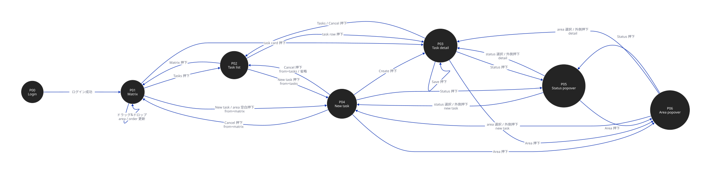

# Task Management Screens

## 目的

モック BE 付き FE プレビューのタスク管理 UI の画面構成と画面遷移を外部設計として定義する。
この文書は画面から観測できる構造だけを扱い、内部実装方式は扱わない。

## 画面一覧

| id | 画面名 | 概要 |
| --- | --- | --- |
| P00 | Login | プレビューへログインする画面 |
| P01 | Matrix | タスクを4象限のマトリックスでDnDする画面 (do statusのタスクのみを表示) |
| P02 | Task list | タスク一覧画面。選択したstatusのタスクを表示する |
| P03 | Task detail | タスク詳細画面 title、description、status、area を確認・編集する |
| P04 | New task | 新規タスク作成画面 |
| P05 | Status popover | 新規作成・詳細画面内のステータス選択パネル |
| P06 | Area popover | 新規作成・詳細画面内のエリア選択パネル |
| P07 | Delete confirmation dialog | Matrix 上の task を完全削除する確認ダイアログ |

## 画面詳細

- `Matrix` (`/`)
  - `status = do` の task だけを表示する。
  - task は `area = 1 / 2 / 3 / 4` の象限に分けて表示する。
  - 縦軸は `重要度`、横軸は `緊急度` とする。
  - task card は title のみを表示する。
  - task card は matrix 上で drag and drop できる。
  - task card を右クリックすると task action menu を表示する。
  - task action menu の選択肢は `done`、`skip`、`delete` とする。
  - `done` を選択すると task の status を `done` に変更し、Matrix から除外する。
  - `skip` を選択すると task の status を `skip` に変更し、Matrix から除外する。
  - `delete` を選択すると Delete confirmation dialog を表示する。
  - task card 以外の空白部分を押下すると、その area を選択済みとして `/tasks/new?area=<area>` へ遷移する。
  - task action menu は右クリックによるマウス操作だけを対象とする。操作ボタン、キーボード操作、タッチ端末の長押し、スクリーンリーダーは対象外とする。

- `Task list` (`/tasks`)
  - `do`、`done`、`skip` の status 切り替えボタンを表示する。
  - status 指定なし、または不正な status で開いた場合は `do` を選択する。
  - 選択した status は `/tasks?status=<status>` で保持し、再読み込み後も維持する。
  - Task list 以外の画面から `/tasks` へ遷移した場合は `do` を選択する。
  - 選択した status と一致する task だけを表示する。該当 task がない場合は空状態メッセージを表示する。
  - 各行は `#番号`、title、area badge、status badge を表示する。
  - area badge は `1 / 2 / 3 / 4` を表示する。
  - status badge は `do / done / skip` を表示する。

- `Task detail` (`/tasks/:id`)
  - title と description を編集する。
  - status と area は右側 metadata として表示する。
  - `Cancel` は遷移前の一覧へ戻る。
  - `Save` は編集内容を保存する。

- `New task` (`/tasks/new`)
  - detail と同じ 2 column layout を使う。
  - title と description を入力する。
  - status と area は右側 metadata として表示する。
  - status と area はそれぞれの popover から選択する。選択内容は `Create` まで保存しない。
  - 初期値は `status = do`、`area = 1` とする。
  - `from` query で遷移元を受け取る。`from=matrix` は Matrix、`from=tasks` または省略時は Task list とする。
  - Matrix の New task と area 新規作成リンクは `from=matrix` を付与し、Task list の New task は `from=tasks` を付与する。
  - `status` / `area` の query 指定は従来どおり初期値へ反映し、`from` と同時に指定できる。`/tasks/new?area=<area>` は指定 area を初期選択する。
  - `Status` / `Area` の選択中も `from` を保持する。
  - `Cancel` は `from` に従い遷移元へ戻る。
  - `Create` は task を作成して detail へ進む。

- `Status popover`
  - new task または detail 画面上で status 選択 popover を開いた状態を表す。
  - 選択肢は `do / done / skip` とする。
  - 完成 UI では同じ detail surface 上で開く。
  - popover と Status / Area サイドパネルの外側を押下すると、現在の選択を保持して通常表示へ戻る。

- `Area popover`
  - new task または detail 画面上で area 選択 popover を開いた状態を表す。
  - 選択肢は `1 / 2 / 3 / 4` とする。
  - 完成 UI では同じ detail surface 上で開く。
  - popover と Status / Area サイドパネルの外側を押下すると、現在の選択を保持して通常表示へ戻る。

- `Delete confirmation dialog`
  - Matrix の中央に表示する。
  - メッセージは「このタスクを削除しますか？」とする。
  - ボタンは `キャンセル` と `削除` とする。
  - 表示中は画面全体を overlay で覆い、背後の Matrix を操作できないようにする。
  - `キャンセル` は task を変更せずにダイアログを閉じる。
  - `削除` は task を完全削除し、Matrix と Task list から除外する。

## 画面遷移

## モック BE プレビュー

- `bun run preview:mock` で起動する。
- `http://127.0.0.1:8787` を開き、パスワード `preview` でログインする。
- Matrix と Task list は固定初期データを表示する。作成・編集・並び替えは実行中だけ保持し、プレビューの再起動後は初期データに戻る。
