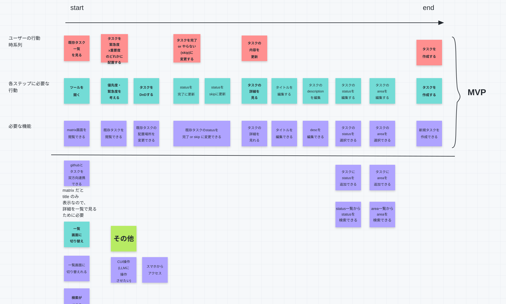

# ユーザーストーリーマップ

> 凍結: これは設計時点の資料である。以後は更新しない。業務フローの生きた正本は `domain-model.json` の `flows` とする。

## 目的

ユーザーの行動順に、MVP で必要な操作と機能を整理する。
この文書は、仕様書とワイヤーフレーム作成時に、必要な画面と機能の
抜け漏れを確認するために使う。

## ユーザーストーリーマップ図

図の正本は [`docs/requirements/assets/user-story-map.drawio`](assets/user-story-map.drawio) とする。

