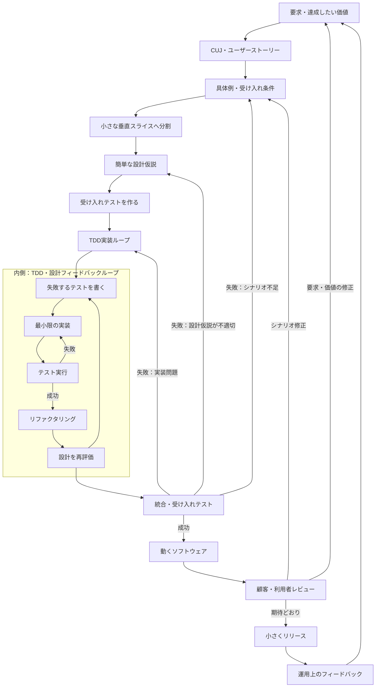
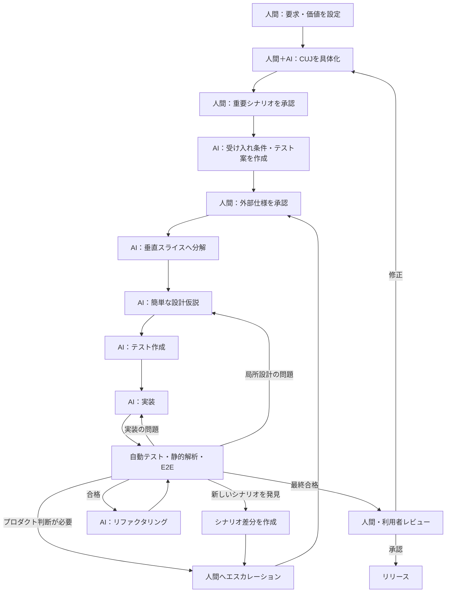
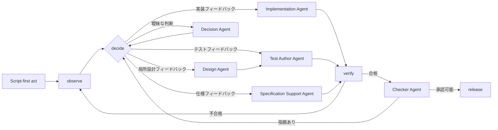

# ループエンジニアリング
LLMによる自動開発とアジャイルを組み合わせる方法

## 目的
LLMエージェントによる半自動・自動開発に、フィードバックループ型の開発手法を組み込む方法を整理すること。

## XP文脈でのループ開発フロー

## AIを入れた場合のフロー

## フィードバックについて

フィードバックを4種類に分け、それぞれで対応を変える。

| 種類 | 例 | 処理 |
| --- | --- | --- |
| 実装フィードバック | テスト失敗、例外、型エラー | AIが自動修正 |
| 局所設計フィードバック | 責務が循環する、性能不足 | 条件内ならAIが設計変更 |
| 仕様フィードバック | 仕様に矛盾・不足がある | 仕様差分を作成 |
| プロダクトフィードバック | 本当にこの動作でよいか | 人間・POが判断 |

## 設計書の運用方針について

コード, テスト, ADR をSSOTとする。

設計書は実装前に合意形成と探索を助けるための仮説として扱い、
実装完了後は削除する (docs/archived/ へ移す)

## エージェント構成を反映したAI開発フロー

## エージェント

| エージェント名 | エージェント名（日本語） | 役割 | 責務 |
| --- | --- | --- | --- |
| Specification Support Agent | 仕様化支援エージェント | 人間・POによる仕様化を支援する | 人間・POが提示した要求と価値を、CUJ、ユーザーストーリー、具体例、受け入れ条件へ構造化する。曖昧さ、矛盾、不足、未定義ケースを検出し、質問、選択肢、影響、推奨案を提示する。人間・POが決定した内容を仕様へ反映し、実装中に見つかった仕様フィードバックは仕様差分案として整理する。要求、価値、優先順位、外部仕様を独断で確定・変更しない。 |
| Design Agent | 設計エージェント | 承認済み仕様を満たす設計仮説を作成・更新する | システム構造、責務、依存関係、データフロー、インターフェースなどの設計仮説を作成する。局所設計フィードバックを受けた場合は設計差分を作成する。公開API、データ契約、セキュリティ境界など、人間の承認が必要な範囲は独断で変更しない。 |
| Test Author Agent | テスト作成エージェント | 仕様と設計を実行可能な完了条件へ変換する | 承認済みの受け入れ条件と設計仮説から、受け入れテスト、単体テスト、統合テスト、E2Eテストを作成する。不具合、境界条件、新しいシナリオが見つかった場合は回帰テストを追加する。プロダクションコードは変更しない。明示的な仕様変更なしに既存テストを削除、無効化、緩和しない。 |
| Implementation Agent | 実装エージェント | テストを満たす最小実装・修正・リファクタリングを行う | 承認済み仕様、設計仮説、Test Author Agentが作成したテストに従い、最小実装、不具合修正、リファクタリングを行う。テストコード、受け入れ条件、仕様は変更しない。テストや設計に問題があると考えた場合は、成果物を変更せずフィードバックとして返す。 |
| Decision Agent | 判断エージェント | ルールだけでは分類できない曖昧なフィードバックを判断する | Policy Router Scriptで戻り先を決定できない場合に限り、観測結果、仕様、設計、テスト、コード差分を読み、実装、テスト、局所設計、仕様、プロダクトのどのフィードバックかを分類する。構造化された次アクション案を返すが、成果物を直接変更しない。仕様・プロダクト判断は人間・POへエスカレーションする。 |
| Checker Agent | 独立検証エージェント | 仕様・設計・テスト・コードを独立して意味的に検証する | Test Author AgentおよびImplementation Agentとは異なる指示・権限で、受け入れ条件との整合、設計とコードの整合、テストの妥当性と不足、見落とされた例外、保守性を評価する。原則として読み取り専用とし、成果物を修正せず、合否、根拠、指摘事項を返す。 |

## スクリプト・機構

| スクリプト／機構 | 対応範囲 | 責務 |
| --- | --- | --- |
| Loop Controller | ループ全体 | 状態遷移、エージェント呼び出し、再試行、タイムアウト、最大ターン数、予算、停止条件を管理する。 |
| Context Builder | 各ステップの前処理 | 対象タスク、関連仕様、設計書、テスト、コード、差分、過去状態を規則に従って収集し、各エージェントへ渡す。 |
| Worktree Manager | `act`の前後 | ブランチ・worktreeの作成、作業領域の隔離、差分保存、ロールバックを行う。 |
| Observation Runner | `observe` | テスト、ビルド、型チェック、Lint、静的解析、カバレッジ、E2E、ベンチマーク、セキュリティスキャンを実行し、結果を構造化する。 |
| Policy Router | `decide` | 終了コード、失敗チェック、変更ファイル、ルール違反などから明白な戻り先を決定する。判断できない場合だけDecision Agentを呼ぶ。 |
| Verification Gate | `verify` | 必須テスト、品質閾値、変更禁止条件、承認状態を機械的に判定する。 |
| Guard Hooks | 全ステップ | 危険コマンド、権限外ファイル変更、テスト削除、仕様の無断変更、予算超過を実行前後に遮断する。 |
| State Recorder | 全ステップ | 現在状態、試行回数、判断結果、検証証跡、失敗した方法、次の処理を保存する。 |

## 変更権限

| 成果物 | 主な変更担当 | 変更してはいけない担当 |
| --- | --- | --- |
| CUJ・外部仕様・受け入れ条件 | 人間・PO、Specification Support Agent | Implementation Agent |
| 設計書・設計差分 | Design Agent | Implementation Agent |
| テストコード | Test Author Agent | Implementation Agent |
| プロダクションコード | Implementation Agent | Test Author Agent、Checker Agent |
| 判定ルール・品質閾値 | 人間・PO、設定ファイル | 各生成エージェント |
| 検証結果・証跡 | Observation Runner、Verification Gate | 各生成エージェント |
| レビュー結果 | Checker Agent | Implementation Agent |

## フィードバックの戻り先

| フィードバック | 主な戻り先 |
| --- | --- |
| 実装フィードバック | Implementation Agent |
| テストフィードバック | Test Author Agent |
| 局所設計フィードバック | Design Agent → Test Author Agent → Implementation Agent |
| 仕様フィードバック | 人間・PO＋Specification Support Agent |
| プロダクトフィードバック | 人間・PO |
| Verify不合格 | Policy RouterまたはDecision Agentで再分類 |
